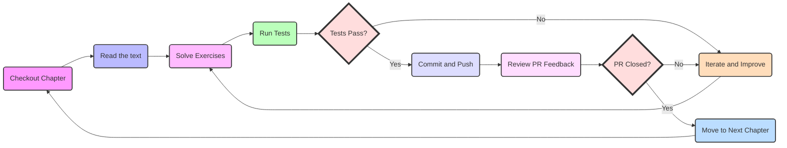

## Welcome to Array! 🚀

Master Data Structures and Algorithms through Interactive GitHub-based Learning

## What is Array?

Array is your launchpad for mastering Data Structures and Algorithms (DSA) using GitHub. We blend textbook learning with hands-on coding, all integrated into a real-world Git workflow.

## Why Choose Array?

- 📚 **Structured, easy-to-follow DSA learning path**
- 💻 **Practical GitHub experience**
- ✅ **Instant code feedback**
- 🔄 **Early PR system for continuous improvement**
- 🏆 **Visual progress tracking**
- 🤝 **Supportive learning community**

## Why Learn Data Structures and Algorithms with GitHub?

Data Structures and Algorithms (DSA) are fundamental to problem-solving in programming. Whether you're preparing for coding interviews, optimizing your coding skills, or building scalable applications, DSA knowledge is crucial.

Array simplifies your DSA learning journey by integrating theory with practical GitHub workflows. You'll master algorithms while acquiring valuable collaboration skills used by developers worldwide.

## Getting Started



### 1. Set Up Your Environment

1. Create a [GitHub account](https://github.com/join) (if you don't have one)
2. Install [Git](https://git-scm.com/downloads)
3. Install GitHub CLI:

   ```bash
   # macOS
   brew install gh
   
   # Windows
   winget install --id GitHub.cli

   # Ubuntu
   sudo apt install gh
   ```

4. Authenticate GitHub CLI:

   ```bash
   gh auth login
   ```

5. Log in to the Array website using your GitHub account.
6. We'll automatically fork the Array repository to your GitHub account.

### 2. Clone and Configure Your Repository

```bash
gh repo clone array_org/array
cd array
```

### 3. Start Your First Chapter

```bash
git checkout chapter-1
gh pr create --fill
```

### 4. Learning Workflow

1. Read the chapter content.
2. Solve the exercises.
3. Run tests: `./run_tests.sh`.
4. Commit and push your progress:

   ```bash
   git add .
   git commit -m "Solved exercise X"
   git push origin chapter-1
   ```

5. Review feedback on your PR.
6. Iterate and improve based on feedback.

### 5. Advancing Through Chapters

- When all tests pass, your PR will automatically close.
- Move to the next chapter:

  ```bash
  git checkout chapter-2
  gh pr create --fill
  ```

- Repeat the learning workflow for each chapter.

## Tips for Success

- Commit frequently to track your progress.
- Ask questions in your PR if you're stuck.
- Embrace feedback as a tool for growth.
- Maintain consistency in your learning schedule.
- Engage with fellow learners to enhance understanding.

## Completion and Recognition

- Celebrate your achievements by adding your name to each chapter.
- Get recognized in the README of legends upon completing all chapters.
- Receive a grand "Congratulations!" for mastering DSA.

Remember, every coding expert started as a beginner. You've got this! 💪😎

Ready to Array? Let's code! 👩‍💻👨‍💻
